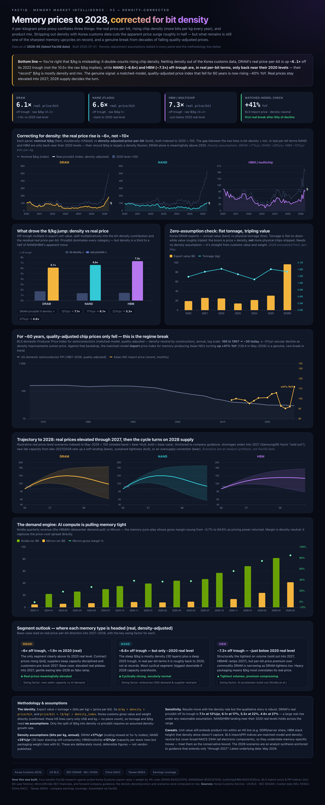

# The Memory Super-Cycle — NAND · DRAM · HBM price trajectory to 2028

An interactive dashboard tracking the AI-driven memory pricing super-cycle and mapping three trajectories through 2028.

> **v2 — corrected for bit density.** A per-kilogram price proxy conflates the real price-per-bit with rising chip density (more bits per kg every year) and product mix. Using Korea customs value **and** weight, the dashboard decomposes the ~10× rise in $/kg into a density component and the residual real price-per-bit: DRAM real price is up **~6×** off its trough (not 10×), while NAND and HBM are, in real per-bit terms, only back near their **2020 levels**. Density assumptions (DRAM +17%/yr, NAND +28%/yr, HBM +12%/yr bits-per-kg) are stated in every panel and the methodology box.

**Live page:** https://rishsriv.github.io/memory-supercycle-2028/

## What it shows

- **The price signal** — Korea customs export unit value (US$/kg) for DRAM, NAND/flash, and HBM/multichip modules, monthly since 2020, log scale. The timeliest public read on the Samsung / SK Hynix duopoly.
- **Trajectory to 2028** — illustrative price-level scenarios (bear → bull band, base case) for each segment, anchored to company guidance.
- **The demand engine** — Nvidia quarterly revenue vs Micron revenue and gross margin (which swung from −0.7% to 84.6%).
- **Official confirmation** — BLS import-price index for Asian-NIC semiconductors vs the flat domestic PPI.
- **Revenue barometer** — monthly Korea memory export value, running at a ~$225B/yr pace.

## Data sources

Korea Customs Service (KCS) · US BLS (import price indices, PPI) · SEC EDGAR / market data (MU, NVDA) · China GACC · Taiwan MOEA · company earnings coverage. Assembled via [FactIQ](https://factiq.com).

## Caveats

- **Price proxy:** export unit value (value ÷ weight) is a directional signal, not a contract price — it embeds product-mix shifts, so absolute US$/kg levels overstate like-for-like chip price moves. Read the *shape and magnitude of change* as the signal.
- BLS publishes no standalone DRAM/NAND index; the Asian-NIC import series is the closest official proxy.
- The **2028 scenarios are an analyst synthesis** anchored to company guidance (tightness confirmed only "through 2027"). No memory maker has issued 2028 pricing guidance.
- Latest underlying data: **May 2026**.

The dashboard is a single self-contained `index.html` (ECharts via CDN; data embedded inline).
